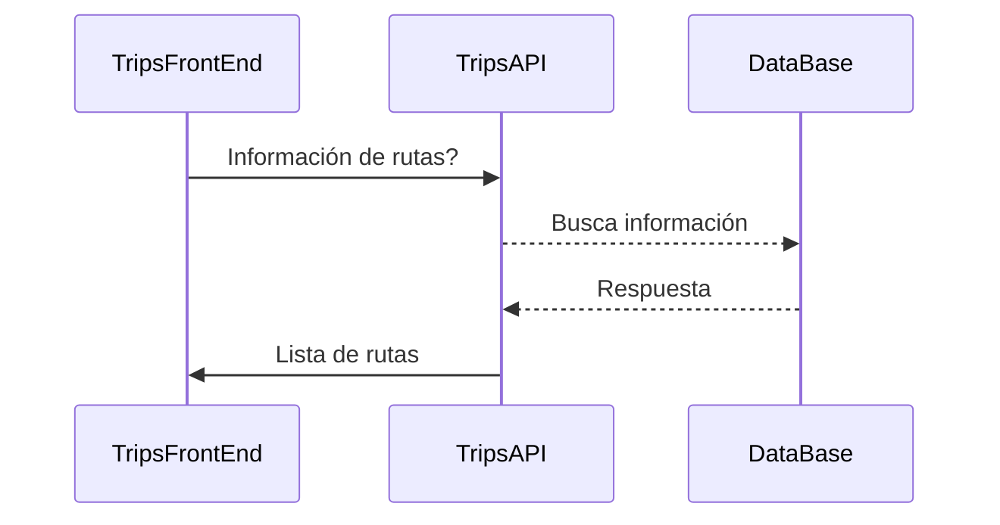

# Aplicacion full stack para FLYR.

### Objetivo.
Solución a la prueba técnica

En este repositiorio encontraras dos aplicaciones:

- TripsAPI (Backend en .NET CORE)
- TripsFrontEnd(Angular) 

## Aplicacion .NET
expicacion general de esta aplicación y link al  [README.md](./TripsAPI/TripsAPI/README.md) del repositorio.

## Aplicacion Angular.
expicacion general de est ap y unlink al  [README.md](./TripsFrontEnd/README.md) del repositorio. 

Nota: dentro de cada repo encontraras como ejecutar cada aplicación

### Flujo principal de la aplicacion
El flujo general es el siguiete:

