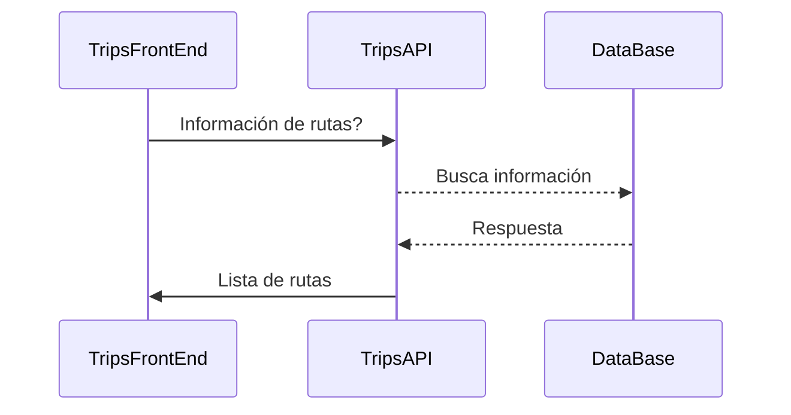

# Aplicacion full stack para FLYR.

### Objetivo.
Solución a la prueba técnica

En este repositiorio encontraras dos aplicaciones:

- TripsAPI (Backend en .NET CORE)
- TripsFrontEnd(Angular) 

## Aplicacion .NET
expicacion general de esta aplicación y link al  [README.md](./TripsAPI/TripsAPI/README.md) del repositorio.

## Aplicacion Angular.
expicacion general de est ap y unlink al  [README.md](./TripsFrontEnd/README.md) del repositorio. 

Nota: dentro de cada repo encontraras como ejecutar cada aplicación

### Flujo principal de la aplicacion
El flujo general es el siguiete:

## Objetivos alcanzados:
### Problema 1: Modelado de clases 
### Problema 2: Consumo REST API 

### Problema 3: Obtener Ruta Parte 1
### Problema 4: btener Ruta Parte 2 (Incompleto)
- Consumo API del problema 3
- Los campos solo deben permitir 3 caracteres exactamente.
- Los campos deben tener una estrategia para que el input siempre se registre en mayúscula.

## Objetivos NO alcanzados:
Problema 4: Modelado de clases.
- Los campos no pueden contener el mismo valor.
- Maquetado de información consultada.
 
Problema 5: Selección Moneda.
 

