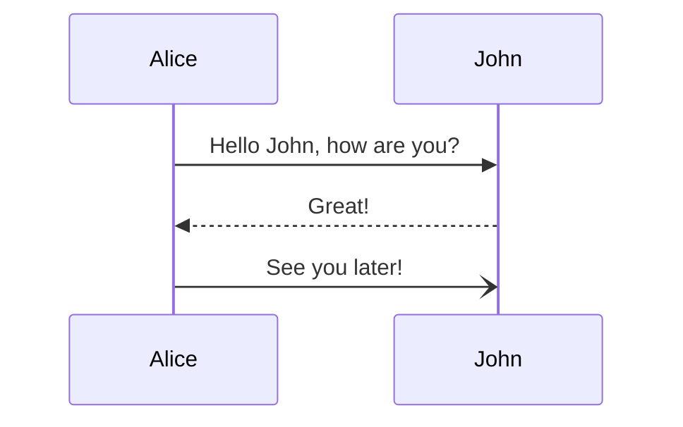

# Aplicacion full stack para ....

### Objetivo.

### Stack

En este repositiorio encontraras dos aplicaciones:

- APS.NER Rest.
- Angular 
- Base de datos 

### Flujo principa de la aplicacion
El flujo general sera el siguiete:

## Aplicacion .NET
expicacion general de est ap y unlink al  [README.md](./TripsAPI/TripsAPI/README.md) de el repo 

## Aplicacion Angular.
expicacion general de est ap y unlink al  [README.md](./TripsFrontEnd/README.md) de el repo 

Nota: dentro de cada repo encontraras como correr la aplicaion